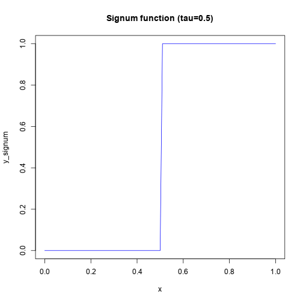

## WGCNA Overview

(Langfelder & Horvath, 2008)

---

## Constructing a co-expression network

1. Choose a similarity metric, construct a similarity
   matrix $S$.
2. Choose an adjacency function (e.g. signum/power)
3. Use adjacency function to map from similarity matrix, 
   $S$ to adjacency matrix, $A$.

## Module detection

Once a co-expression network has been constructed, WGCNA can be used to detect
module of genes with similar expression profiles.

1. Choose a node dissimilarity measure.
2. Example: 1 - correlation
3. WGCNA method: 1 - Topological Overlap

--- .segue .dark

## Constructing a co-expression network ##

---

## Similarity matrix

The first step is to choose a similarity metric, e.g. |Pearson correlation|,
and use it to construct a similarity matrix, $S$.

$$
s_{ij} = |cor(i, j)|
$$

Where

$$
cor(X, Y) = \rho_{X,Y} = \frac{Cov(X,Y)}{\sigma_X \sigma_Y}
$$

The more similar a pair of gene's expression profiles are across time, the
higher this value will be (max=1).

By applying the metric to each pair of genes in the dataset, an $n \times n$
similarity matrix is produced.

---

## Similarity matrix

Heatmap for 250 most highly expressed genes.

---

## Adjacency matrix

Once a similarity matrix has been constructed, this is converted into an
[adjaceny matrix](http://en.wikipedia.org/wiki/Adjacency_matrix), which defines 
the co-expression graph or network.

An adjacency function is chosen which maps from
co-expression similarities to 
edge weights.

There are two major types of adjacency functions, the choice of which
determines whether the resulting network will be weighted or unweighted.

1. Unweighted (hard threshold)
 - Remove all edges below a certain similarity cutoff; set everything else to 1.
 - [Sign (signum) function](http://en.wikipedia.org/wiki/Signum_function)
2. Weighted (soft threshold)
 - Choose a function which maps from $(0,1)$ to $(0,1)$.
 - [Sigmoid function](http://en.wikipedia.org/wiki/Sigmoid_function)
 - [Power function](http://en.wikipedia.org/wiki/Power_function)

---

## Unweighted Network
Signum Function

 $$ a_{ij} = signum(s_{ij}, \tau) \equiv
   \left\{ 
      \begin{array}{l l}
        1 & \quad \text{if}\ s_{ij} \ge \tau\\
        0 & \quad \text{if}\ s_{ij} \lt \tau
   \end{array} \right.
 $$

 

---

## Weighted Network
Sigmoid Function

$$
a_{ij} = sigmoid(s_{ij}, \alpha, \tau_0) \equiv \frac{1}{1 + e^{-\alpha(s_{ij} - \tau_0)}}
$$

 

---

## Weighted Network
Power Function

$$
  a_{ij} = power(s_{ij}, \beta) \equiv |s_{ij}|^\beta
$$

 

--- .seque .dark

## How do we select an appropriate adjacency function?

---

## Scale-free networks

- Many biological networks (including co-expression networks) are thought to
follow a [power law distribution](https://en.wikipedia.org/wiki/Power_law)^1.
- For co-expression networks with genes as nodes, the degree distribution $p(k)$
for genes follows:
$$
p(k) \sim k^{-\gamma}
$$
where $k$ is the number of connections to other genes.
- Networks which follow this degree distribution are referred to as "scale-free".
- Scale-free networks are robust to errors, however,
- They are also vulnerable to attack at particular 
  nodes (good for us!).

---

## Scale-free networks

The exponent $\gamma$ determines how quickly the distribution decays,
for example:

 

---

## Scale-free networks

- This property of biological networks can be used by us to help guide our
  selection of an adjacency function and parameters.
- The goal then becomes selecting a function and parameters such that the
  resulting co-expression network has the scale-free property.

--- .segue .dark

## Module detection ##

---

## Clustering gene expression profiles

K-means clustering of T. cruzi RNA-Seq time-course data.

---

## Topological Overlap Matrix

>- The preferred method used by WGCNA to cluster gene expression profiles is
to first construct a similarity matrix using a measure called Topological
Overlap.
>- Topological overlap -> interconnectedness between two genes
>- The resulting Topological Overlap Matrix (TOM) is then subtracted from
   one to obtain a dissimilarity measure which can be used for clustering.
>- TOM $\Omega = [\omega_{ij}]$

$$
\omega_{ij} = \frac{l_{ij} + a_{ij}}{\min{\{k_i, k_j\}} + 1 - a_{ij}}
$$

Where

$$l_{ij} = \sum_u{a_{iu}a_{uj}}$$

And

$$k_i = \sum_u{a_{iu}}$$

---

## Clustering

- [Average linkage hierarchical clustering](http://en.wikipedia.org/wiki/Hierarchical_clustering#Linkage_criteria)
  used to group genes based on their TOM dissimilarity.
- Gene modules then correspond to branches in the hierarchical clustering
  dendrogram.
- Smaller power law exponent: fewer modules, more genes
- Larger power law exponent: more modules, fewer genes
- For me: ~5-25 modules on average, depending on params.

---

## TOM Plot
TOM Plot can help us to visualize gene modules: red blocks along the diagonal
correspond to clusters of genes with a high topological overlap. These are our
clusters.

---

## Module Eigengenes

Module eigengenes can be computed and a dendrodram of the eigengenes can be
constructed and used to guide the merging of similar modules.

---

## Comparison to other clustering methods

When comparing the results of WGCNA module detection to other commonly used
clustering methods, the results can be very different.

---

## Exporting the network for visualization

In order to visualize the network in another application such as 
[Cytoscape](http://www.cytoscape.org/), it is first necessary to choose a
cutoff for which edges should be included.

- A Low cutoff (e.g. topological overlap >= 0.15) will
  result in many edges and become very difficult to work with.
- A High cutoff (e.g. 0.55) will have fewer edges, 
  but can still be in the tens or hundreds of thousands, and we may have lost 
  some important edges.

Alternatively, network modules can also be exported and visualized in isolation
with a higher cutoff value, however, inter-module edges will not lost in this
case.

---

