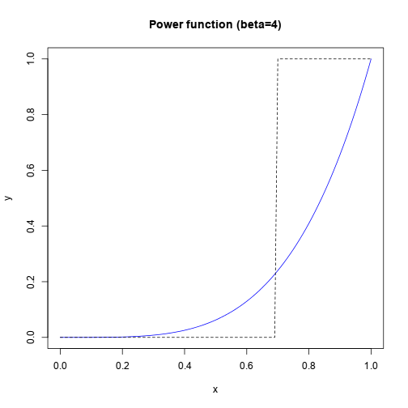
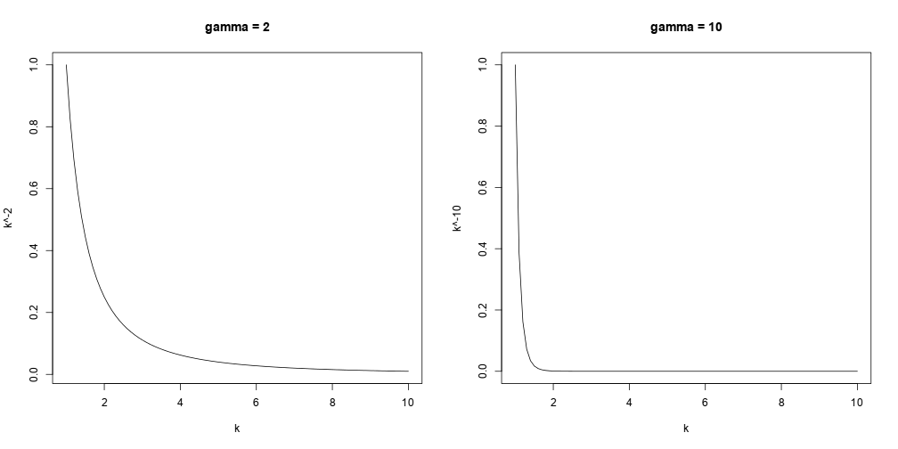
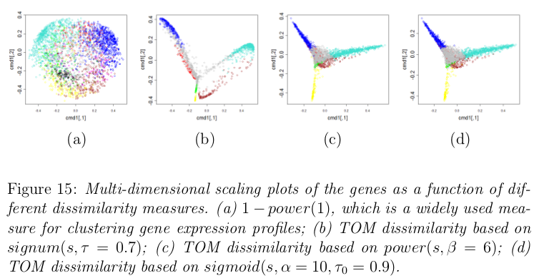
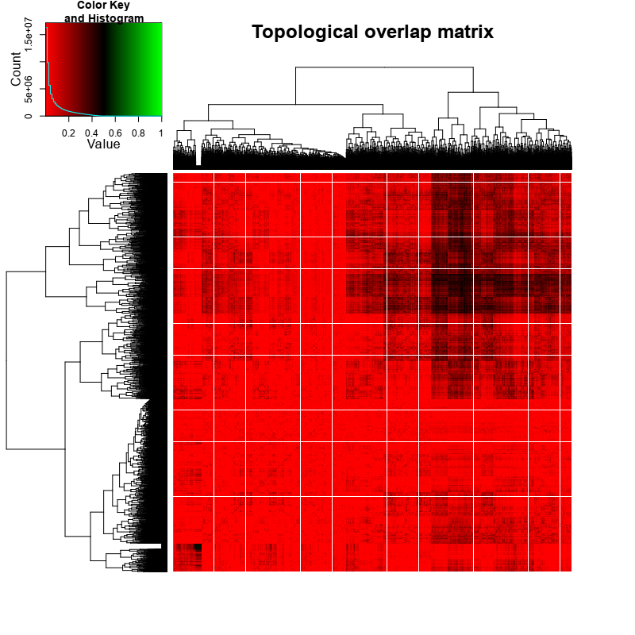
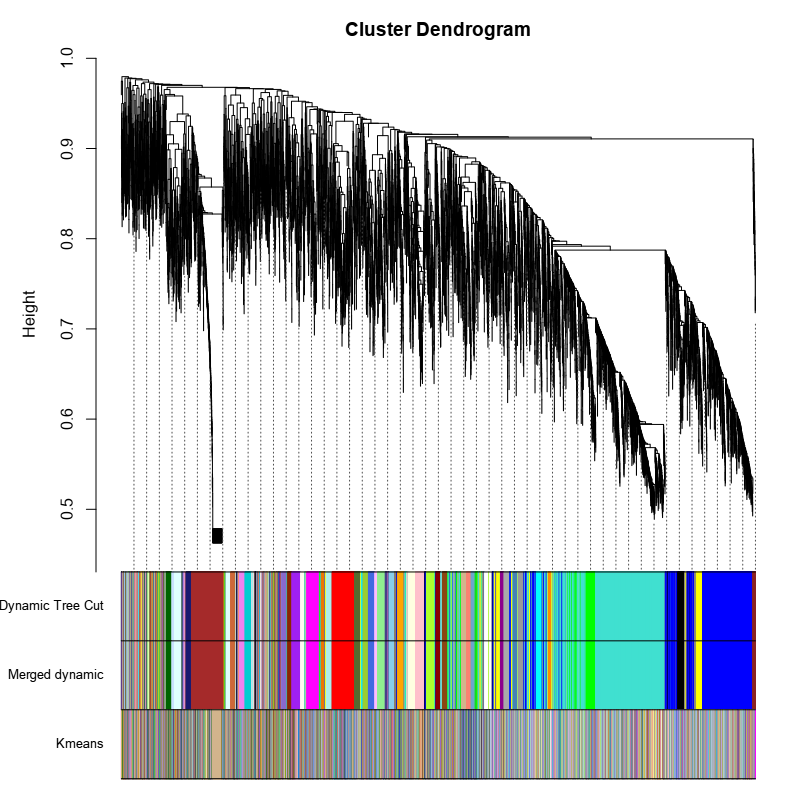

## Types of Molecular Biological Networks

1. Cell signalling networks
2. Metabolic networks
3. Protein-protein interaction networks
4. Co-expression networks

**Basic goal**: understand cellular phenomena at a systems scale.

---

## Co-expression Networks

### M. Eisen (1998)
- Clusters of co-expressed genes tend to have similar function in yeast.

### Butte & Kohane (2000)
- Mutual information relevance networks: functional genomic clustering using
  pairwise entropy measurements (**Butte and Kohane (2000)**)
  - First co-expression networks
  - Mutual Information used as similarity measure
  - Edges determined via hard cutoff

---

## Co-expression Networks

### Zhang & Horvath (2005)
- WGCNA
    - Soft-threshold (weighted network)
    - Pearson correlation used as similarity measure by default
    - Also attempts to find functional modules in networks

### Hong et al (2013)
- Canonical correlation analysis for RNA-seq co-expression networks.

---

## WGCNA Overview

(Langfelder & Horvath, 2008)

---

## Constructing a co-expression network

1. Choose a similarity metric, construct a similarity
   matrix $S$.
2. Choose an adjacency function (e.g. signum/power)
3. Use adjacency function to map from similarity matrix, 
   $S$ to adjacency matrix, $A$.

## Module detection

Once a co-expression network has been constructed, WGCNA can be used to detect
module of genes with similar expression profiles.

1. Choose a node dissimilarity measure.
    - Common approach: 1 - Correlation
    - WGCNA method: 1 - Topological Overlap
2. Use hierarchical clustering to construct a dendrogram.
3. Modules reflect dense branches on the dendrogram.

--- .segue .dark

## Constructing a co-expression network ##

---

## Similarity matrix

### Setup

Given a matrix $X$ of $n$ gene expression measurements across $m$ sample
measurements ("sample traits", e.g. disease state, time, etc.):

$$X = [x_{ij}]$$

The first step is to choose a similarity metric, e.g. |Pearson correlation|,
and use it to construct a similarity matrix, $S$.

$$
s_{ij} = |cor(i, j)|
$$

Where

$$
cor(X, Y) = \rho_{X,Y} = \frac{Cov(X,Y)}{\sigma_X \sigma_Y}
$$

The more similar a pair of gene's expression profiles are across time, the
higher this value will be (max=1).

By applying the metric to each pair of genes in the dataset, an $n \times n$
similarity matrix is produced.

---

## Similarity matrix

### Alternative similarity measures
- Jacknifed correlation coefficient
- Biweight midcorrelation
- Spearman correlation
- $\frac{1 + cor(i, j)}{2}$

### Questions:
 - Is pearson correlation a good measure of similarity at small $n$?
 - How would the matrix look if we preserved the sign of the correlation
   coefficient?

---

## Adjacency matrix

Once a similarity matrix has been constructed, this is converted into an
[adjaceny matrix](http://en.wikipedia.org/wiki/Adjacency_matrix), which defines 
the co-expression graph or network.

An adjacency function is chosen which maps from
co-expression similarities to 
edge weights.

There are two major types of adjacency functions, the choice of which
determines whether the resulting network will be weighted or unweighted.

1. Unweighted (hard threshold)
 - Remove all edges below a certain similarity cutoff; set everything else to 1.
 - [Sign (signum) function](http://en.wikipedia.org/wiki/Signum_function)
2. Weighted (soft threshold)
 - Choose a function which maps from $(0,1)$ to $(0,1)$.
 - [Sigmoid function](http://en.wikipedia.org/wiki/Sigmoid_function)
 - [Power function](http://en.wikipedia.org/wiki/Power_function)

---

## Signum Function (Unweighted Network)

 $$ a_{ij} = signum(s_{ij}, \tau) \equiv
   \left\{ 
      \begin{array}{l l}
        1 & \quad \text{if}\ s_{ij} \ge \tau\\
        0 & \quad \text{if}\ s_{ij} \lt \tau
   \end{array} \right.
 $$

 

---

## Sigmoid Function (Weighted Network)

$$
a_{ij} = sigmoid(s_{ij}, \alpha, \tau_0) \equiv \frac{1}{1 + e^{-\alpha(s_{ij} - \tau_0)}}
$$

 

---

## Power Function (Weighted Network)

$$
  a_{ij} = power(s_{ij}, \beta) \equiv |s_{ij}|^\beta
$$

 

---

## Power Function (Weighted Network)

- WGCNA uses the power function by default to map from the similarity matrix
  to an adjacency matrix.
- Why?:
    - Sigmoid and power function results in similar adjacency matrices if
      parameters are chosen based on same criterion (discussed next).
    - Power adjacency function has the "factorization property"
        - $a_{ij} = a_i * a_j$
        - Understanding network concepts in modules (Dong & Horvath, 2007)

---

## Different adjacency functions can be used to arrive at the same result

--- .seque .dark

## How do we select an appropriate adjacency function?

---

## Scale-free networks

- Many biological networks (including co-expression networks) are thought to
follow a [power law distribution](https://en.wikipedia.org/wiki/Power_law).
- For co-expression networks with genes as nodes, the degree distribution $p(k)$
for genes follows:
$$
p(k) \sim k^{-\gamma}
$$
where $k$ is the number of connections to other genes.
- Networks which follow this degree distribution are referred to as "scale-free".
- Scale-free networks are robust to errors, however,
- They are also vulnerable to attack at particular 
  nodes (good for us!).

---

## Scale-free networks

The exponent $\gamma$ determines how quickly the distribution decays,
for example:

 

---

## Scale-free networks

- This property of biological networks can be used by us to help guide our
  selection of an adjacency function and parameters.
- The goal then becomes selecting a function and parameters such that the
  resulting co-expression network has the scale-free property.

## Scale-free networks

Evaluating the fit using a  log-log plot.

---

## Topological Overlap Matrix

>- The preferred method used by WGCNA to cluster gene expression profiles is
to first construct a similarity matrix using a measure called Topological
Overlap.
>- Topological overlap -> interconnectedness between two genes
>- The resulting Topological Overlap Matrix (TOM) is then subtracted from
   one to obtain a dissimilarity measure which can be used for clustering.
>- TOM $\Omega = [\omega_{ij}]$

$$
\omega_{ij} = \frac{l_{ij} + a_{ij}}{\min{\{k_i, k_j\}} + 1 - a_{ij}}
$$

Where

$$l_{ij} = \sum_u{a_{iu}a_{uj}}$$

And

$$k_i = \sum_u{a_{iu}}$$

---

## Topological Overlap Matrix

Comparison of using topological overlap with $1 - S_{ij}$.

--- .seque .dark

## What we have so far...

---

## Similarity matrix

T. cruzi (4-24hrs)

---

## Adjacency matrix

T. cruzi (4-24hrs)

---

## Topological overlap matrix

T. cruzi (4-24hrs)

--- .segue .dark

## Module detection ##

---

## Clustering gene expression profiles

K-means clustering of T. cruzi RNA-Seq time-course data (just an example to
give us a picture of what we are doing.)

---

## Clustering

- [Average linkage hierarchical clustering](http://en.wikipedia.org/wiki/Hierarchical_clustering#Linkage_criteria)
  used to group genes based on their TOM dissimilarity.
- Gene modules then correspond to branches in the hierarchical clustering
  dendrogram.
- Smaller power law exponent: fewer modules, more genes
- Larger power law exponent: more modules, fewer genes
- For me: ~5-25 modules on average, depending on params.

---

## TOM Plot
TOM Plot can help us to visualize gene modules: red blocks along the diagonal
correspond to clusters of genes with a high topological overlap. These are our
clusters.

---

## Module Eigengenes

Module eigengenes can be computed and a dendrodram of the eigengenes can be
constructed and used to guide the merging of similar modules.

---

## Comparison to other clustering methods

When comparing the results of WGCNA module detection to other commonly used
clustering methods, the results can be very different.

---

## Network Visualization

### Problem

- Estimate hard threshold cutoff and use that when exporting network for
  visualization!
- In order the visualize the network using something like Cytoscape, a hard
  threshold has to be chosen to limit the number of edges.
- Since the adjacency function is monotonically increasing, however, this
  in effect gives us the same network as if we had used hard-thresholding
  to begin with.

---

## Other topics to discuss (time permitting):

1. Cluster coefficient in weighted vs. unweighted networks (Section 7, fig 10)
2. Alternatives to correlation networks (partial correlations, etc.)
3. Module detection
   - alternative clustering methods
   - choosing branch height to cut at (e.g. Dynamic Tree Cut)
   - Fuzzy module membership

References
----------

- Bin Zhang, Steve Horvath,   (2005) A General Framework For Weighted Gene co-Expression Network Analysis.  <em>Statistical Applications in Genetics And Molecular Biology</em>  <strong>4</strong>  <a href="http://dx.doi.org/10.2202/1544-6115.1128">10.2202/1544-6115.1128</a>

- Mutual information relevance networks: functional genomic clustering using
pairwise entropy measurements. Butte AJ, Kohane IS. (2000)
